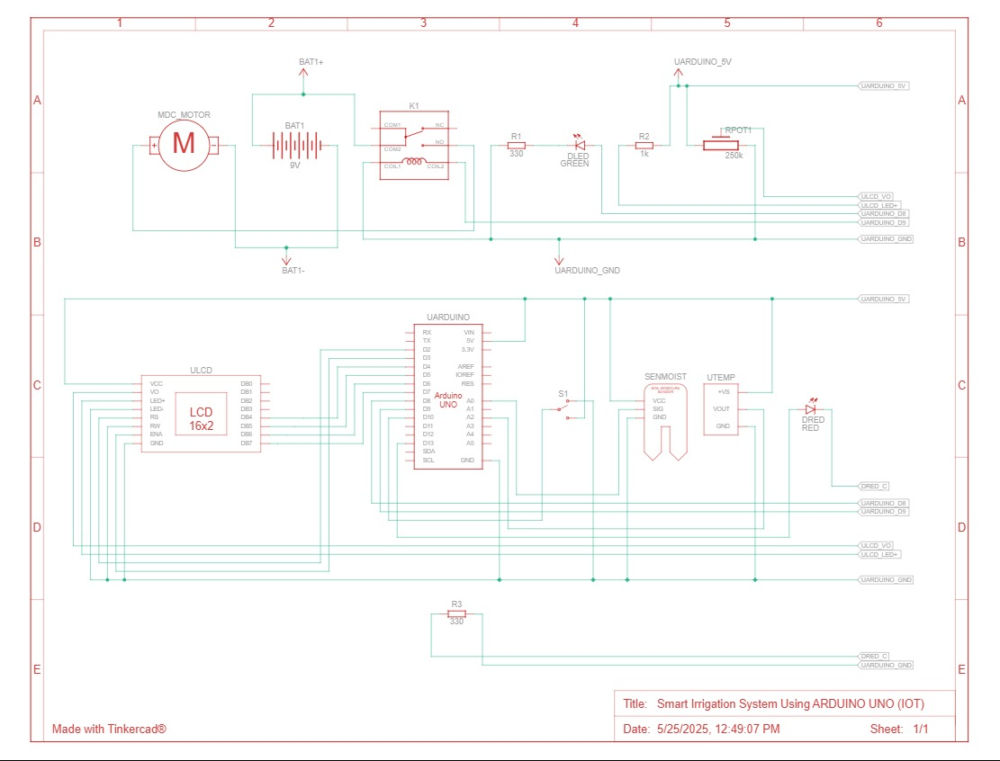
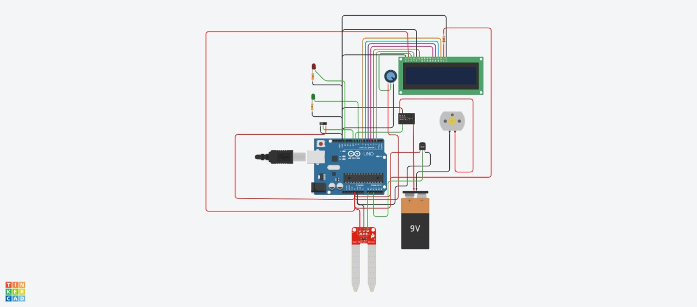

# 🌱 Smart Irrigation System using Arduino Uno

This is an automated irrigation system built using Arduino Uno, which uses soil moisture levels, temperature, and humidity to control a water pump. It displays live readings and pump status on a 16x2 LCD.

---

## 📜 Table of Contents

- [Part List](#part-list)
- [Hardware Architecture](#hardware-architecture)
- [Software Architecture](#software-architecture)
- [Setup Arduino Uno](#setup-arduino-uno)
- [Usage](#usage)
- [Contributing](#contributing)
- [License](#license)

---

## 🧰 Part List

| Component                  | Quantity |
|---------------------------|----------|
| Arduino Uno               | 1        |
| DHT11 Temperature & Humidity Sensor | 1 |
| Soil Moisture Sensor      | 1–2      |
| 5V Relay Module           | 1        |
| Water Pump (5V/12V)       | 1        |
| 16x2 LCD Display (with potentiometer) | 1 |
| Potentiometer (for LCD contrast) | 1 |
| LEDs (Green & Red)        | 1 each   |
| Jumper Wires              | As needed|
| Breadboard                | 1        |
| Power Supply (for pump)   | 1        |

---

## 🧩 Hardware Architecture

The system works as follows:

- Soil moisture is continuously monitored.
- If the soil is dry, the water pump is activated via a relay.
- Temperature and humidity are logged using the DHT11 sensor.
- Live data is shown on the LCD and through Serial Monitor.

Below is the schematic diagram and breadboard layout of the Smart Irrigation System.

### Circuit Diagram

### Breadboard Simulation

---

## 🧠 Software Architecture

The code runs in a continuous loop:

1. Reads analog soil moisture data.
2. Maps it to a percentage.
3. Reads temperature and humidity.
4. Decides whether to activate the pump based on soil moisture thresholds.
5. Displays the system status on an LCD and sends logs to the serial monitor.

---

## 🔌 Setup Arduino Uno

1. **Install Libraries:**
   - [DHT sensor library by Adafruit](https://github.com/adafruit/DHT-sensor-library)
   - [LiquidCrystal](https://www.arduino.cc/en/Reference/LiquidCrystal)

2. **Wiring:**
   - Soil Moisture Sensor → A0
   - DHT11 Sensor → Pin 10
   - Relay (Pump) → Pin 9
   - Green LED → Pin 6
   - Red LED → Pin 7
   - LCD → Pins 12, 11, 2, 3, 4, 5
   - Potentiometer → LCD contrast adjustment

3. **Upload Code:**
   - Open `Code/irrigation_system.ino` in Arduino IDE
   - Select the correct board and port
   - Upload the sketch

---

## 🎥 Demo Video

Watch the full demonstration of the Smart Irrigation System in action:

Click the thumbnail above or [watch it on YouTube](https://www.youtube.com/watch?v=62pj2NatNvk).

---

## 🚀 Usage

Once powered:

- The LCD displays real-time temperature, humidity, and soil moisture.
- The pump turns ON automatically when soil moisture drops below 30%, and OFF when above 50%.
- Green/Red LEDs indicate the pump status.

---

## 🛠️ Troubleshooting

If you're facing issues with sensor readings, LCD not displaying properly, or the pump not triggering, refer to the [Troubleshooting Guide](troubleshooting.md) for common fixes.

---

## 🤝 Contributing

Contributions are welcome! Feel free to fork this repository and submit pull requests.

Steps:
1. Fork the project
2. Create a new branch (`git checkout -b feature/your-feature`)
3. Commit your changes (`git commit -m 'Add some feature'`)
4. Push to the branch (`git push origin feature/your-feature`)
5. Open a Pull Request

---

## 📄 License

This project is licensed under the [MIT License](LICENSE).
